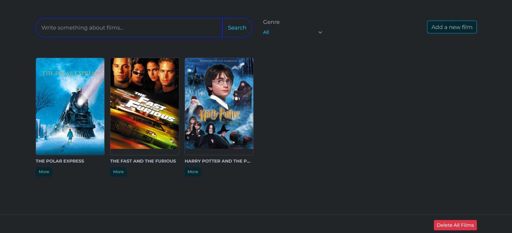
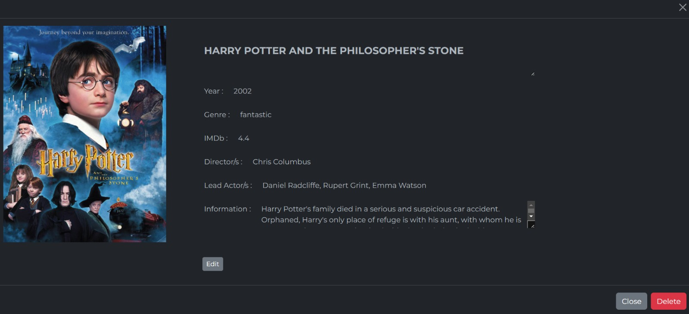
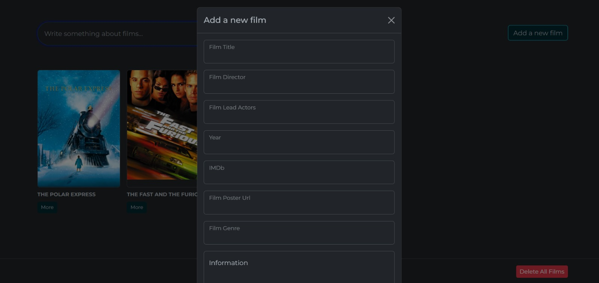

## Table of contents

- [Overview](#overview)
  - [The challenge](#the-challenge)
  - [Screenshot](#screenshot)
  - [Links](#links)
- [My process](#my-process)
  - [Built with](#built-with)
  - [What I learned](#what-i-learned)
  

## Overview

### The challenge

Users should be able to:

- View the optimal layout for the app depending on their device's screen size
- Add new films to the list
- Delete one existing film from the list or all films list 
- Filter by genre of the films
- Search by name of the films
- Access to all information of the movie (via using more button)
- Edit film informations

### Screenshot

### Links

- Solution URL: [Add solution URL here]
- Live Site URL: [https://overconfident-representative.surge.sh/]

## My process

### Built with

- Semantic HTML5 markup
- CSS custom properties
- Bootstrap v5.3
- Vanilla JavaScript

### What I learned

While developing the Movie application, I implemented and improved the following items:

1. HTML & CSS & Bootstrap Basics:
    - Creating jobs to be done with HTML tags.
    - Implementation of visual style (design) with Bootstrap & CSS.

2. DOM Manipulation (Document Object Model):
    - Select, change and manipulate HTML DOM elements using JavaScript.

3. Data Structures and Variables:
    - Use of variables in JavaScript.
    - Array usage: Using arrays to store the work to be done.

4. Event Listeners:
    - Using event listeners to listen and react to user interactions (clicks, submit, etc.).

5. Local Storage Usage:
    - Storing and retrieving data using browsers' local storage mechanisms.
   
8. Functions and Conditional Statements:
    - Creating and using JavaScript functions.
    - Using conditional statements (if, else if, else).

9. Prototypes:
    - Adding functions to prototype

10. ES6+ properties:
    - Using Class Structures

10. Organization:
    - Dividing the project into modules according to their operations (storage, ui etc.)

11. Dynamic Content Creation:
    - Creating dynamic content, such as users adding new films and deleting existing films.

These items cover the major issues I encountered while developing this basic movie app. While developing the application, I had the opportunity to understand, reinforce and apply these topics and helped me improve my JavaScript, HTML and CSS skills more.In the project, I mostly worked on dividing the project into modules, prototype structure, and also ES6+ features. That's why I did the project in two ways, first by using constructor functions and Prototypes, and the other by using the class structure with ES6+ features.

